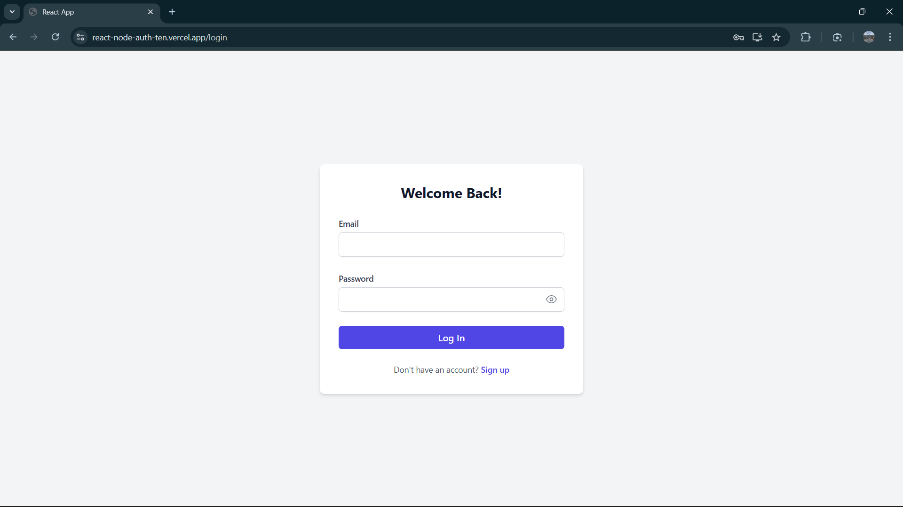
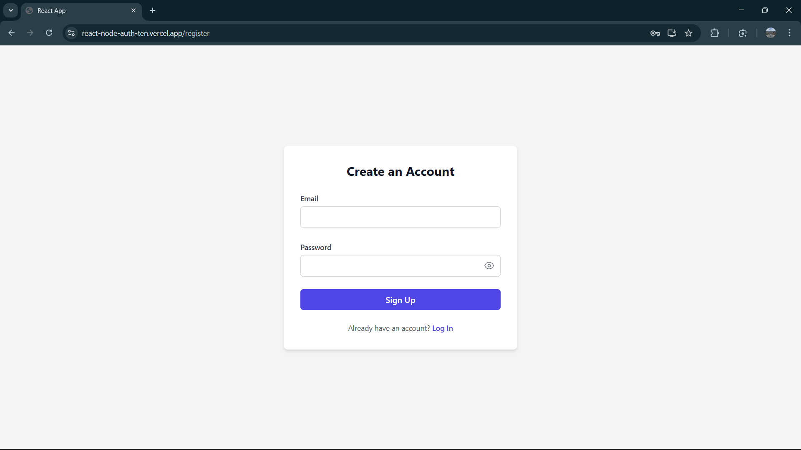
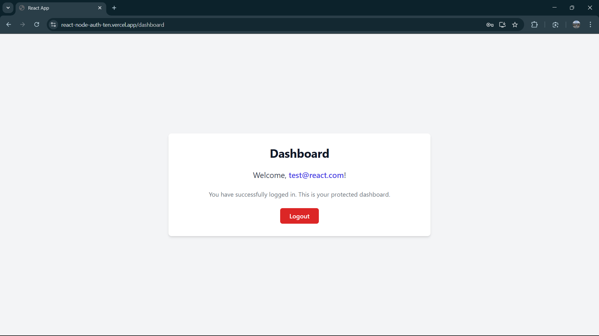

# React & Node.js Authentication Starter

A full-stack user authentication system built with React.js for the frontend and Node.js/Express for the backend. This project features a secure login/logout flow using cookie-based sessions and a protected dashboard route. It uses SQLite for a lightweight, file-based database, making it easy to set up and run.

### 🚀 [View Live Demo](https://react-node-auth-ten.vercel.app/)


---

## ✨ Features

-   **User Registration:** Create a new account with a unique email and a securely hashed password.
-   **User Login:** Authenticate users with stored credentials.
-   **Session Management:** Uses `express-session` to maintain user sessions with secure cookies.
-   **Protected Routes:** The `/dashboard` is only accessible to logged-in users.
-   **Secure Logout:** Clears the session from the server and the cookie from the browser.
-   **Password Hashing:** Uses **bcrypt.js** to hash passwords before storing them in the database.
-   **Modern UI:** Clean, responsive, and modern user interface built with **Tailwind CSS**.

---

## 🛠️ Tech Stack

-   **Frontend:** React.js, React Router, Axios, Tailwind CSS
-   **Backend:** Node.js, Express.js
-   **Database:** SQLite
-   **Authentication:** express-session, cookie-parser, bcrypt.js

---

## 📸 Screenshots

| Login Page                               | Register Page                            | Dashboard                                |
| ---------------------------------------- | ---------------------------------------- | ---------------------------------------- |
|  |  |  |

---

## 📂 Project Structure

```
react-node-auth/
│
├── backend/
│   ├── db.js
│   ├── server.js
│   ├── routes/
│   │   └── auth.js
│   ├── users.db
│   └── package.json
│
└── frontend/
├── src/
│   ├── components/
│   ├── context/
│   ├── App.js
│   └── index.css
├── tailwind.config.js
└── package.json
```

---

## ⚙️ Setup and Run Locally

Follow these instructions to get the project running on your local machine.

### Prerequisites

-   Node.js (v18 or later recommended)
-   npm

### 1. Clone the Repository

```bash
git clone [https://github.com/Maheeth/react-node-auth.git](https://github.com/Maheeth1/react-node-auth.git)
cd react-node-auth
```

### 2. Backend Setup

Open a terminal and navigate to the backend directory.
```
# Navigate to the backend folder
cd backend

# Install dependencies
npm install

# Start the server
node server.js

# The backend will be running on http://localhost:5000
```
### 3. Frontend Setup
Open a new terminal and navigate to the frontend directory.
```
# Navigate to the frontend folder
cd frontend

# Install dependencies
npm install

# Start the React application
npm start

# The frontend will be running on http://localhost:3000
```
Once both the frontend and backend are running, you can open your browser to http://localhost:3000 to use the application.

---

##  Deployment
This application is configured for easy deployment.

**Backend**: Deployed on Render as a Node.js Web Service. The Root Directory is set to backend.

**Frontend**: Deployed on Vercel. The Root Directory is set to frontend.

Environment variables for the API URL (REACT_APP_API_URL) on the frontend and the CORS origin (FRONTEND_URL) on the backend must be configured for the deployed versions to communicate
